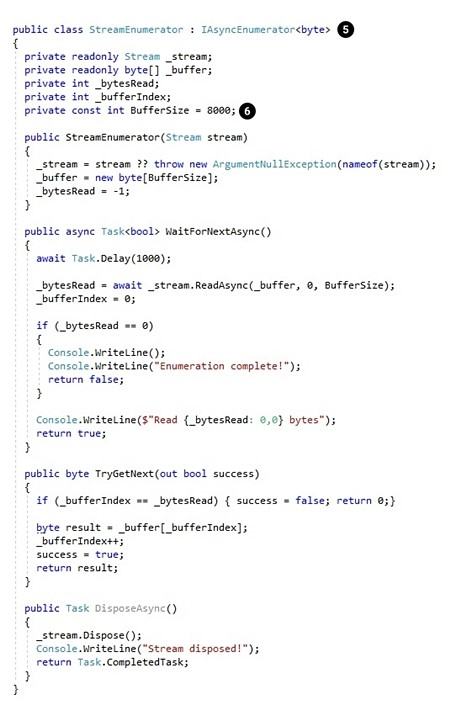

# Асинхронные потоки в C# 8

**[Автор оригинала: Bassam Alugili](https://www.infoq.com/articles/Async-Streams/)**
*Редактор: Jeff Martin*

Основные моменты
- Методы асинхронного программирования помогают сократить время отклика программы.
- Впервые шаблон Async/Await появился в C# 5 и мог возвращать только одно скалярное значение.
- Асинхронные потоки Async Streams появились в C# 8. С их помощью асинхронный метод может возвращать несколько значений.
- Эти потоки – отличный способ для представления асинхронных источников данных, управляемых различными потребителями.
- Кроме того, это альтернатива модели реактивного программирования, используемой в Java и JavaScript.

Async/Await появился в C# 5, чтобы улучшить скорость отклика пользовательского интерфейса и веб-доступ к ресурсам. Другими словами, асинхронные методы помогают разработчикам выполнять асинхронные операции, которые не блокируют потоки и возвращают один скалярный результат. После многочисленных попыток Microsoft упростить асинхронные операции, шаблон async/await завоевал хорошую репутацию среди разработчиков благодаря простому подходу.

Существующие асинхронные методы значительно ограничены тем, что должны возвращать скалярный результат (одно значение). Давайте рассмотрим метод `async Task<int> DoAnythingAsync()`. Результатом работы DoAnythingAsync является целое число (одно значение). Из-за такого ограничения нельзя использовать эту функцию с ключевым словом `yield` и асинхронным интерфейсом `IEnumerable<int>` (возвращает результат асинхронного перечисления).

Если объединить функцию `async/await` и оператор `yield`, тогда можно было бы использовать мощную модель программирования, известную как асинхронное вытягивание данных, или перечисление на основе вытягивания данных или асинхронную последовательность, как она называется в F#.

Новая возможность использования асинхронных потоков в C# 8 снимает ограничение, связанное с одним скалярным результатом, и позволяет асинхронному методу возвращать несколько результатов. Эти изменения придадут асинхронному шаблону больше гибкости, а пользователь сможет извлекать данные из базы с помощью отложенных асинхронных последовательностей или получать данные из асинхронных последовательностей частями по мере доступности.

Пример:

```csharp
foreach await (var streamChunck in asyncStreams)
{
  Console.WriteLine($“Received data count = {streamChunck.Count}”);
}
```

Ещё один подход для решения проблем, связанных с асинхронным программированием, заключается в использовании реактивных расширений (Rx). `Rx` приобретает всё большее значение среди разработчиков. Этот метод используется во многих языках программирования, например Java (RxJava) и JavaScript (RxJS).
В основе Rx лежит модель программирования на базе выталкивания данных (принцип Tell Don’t Ask), также известная, как реактивное программирование. Это особый тип программирования, управляемого событиями, который скорее обрабатывает данные, чем уведомления. Обычно эта модель не позволяет управлять издателем. Данные выталкиваются в очередь в асинхронном режиме и потребитель использует их в момент поступления. В отличие от Rx, асинхронные потоки можно вызвать по требованию для создания нескольких значений до завершения операции перечисления.

В этой статье я сравню модель на основе выталкивания данных с моделью на основе вытягивания данных, а также покажу, для каких сценариев лучше подходит та или иная модель. Вся концепция и преимущества рассматриваются с помощью множества примеров и демонстрационного кода. В конце я покажу принцип применения асинхронных потоков и продемонстрирую его на примере кода. 

## Сравнение модели на основе выталкивания данных с моделью на основе вытягивания данных


*Рис. -1- Сравнение модели на основе вытягивания данных с моделью на основе выталкивания данных*

Эти примеры основаны на взаимоотношениях поставщика и потребителя данных, как показано на рис. -1-. Модель на основе вытягивания данных проста для понимания. В ней потребитель запрашивает и получает данные от поставщика. Альтернативным подходом является модель на основе выталкивания данных. Здесь, поставщик публикует данные в очереди и потребитель должен подписаться на неё, чтобы получить нужные данные.

Модель на основе вытягивания данных подходит для тех случаев, где поставщик генерирует данные быстрее, чем потребитель использует их. Таким образом, потребитель получает только необходимые данные, что позволяет избежать проблем с переполнением.  Если потребитель использует данные быстрее, чем поставщик их производит, подойдёт модель на основе выталкивания данных. В этом случае поставщик может отправить потребителю больше данных, чтобы не возникло ненужных задержек.

Rx и [Akka Streams](https://doc.akka.io/docs/akka/2.5/stream/stream-introduction.html) (модель программирования на основе потоков) используют метод обратного давления для управления потоком. Чтобы решить проблемы поставщика и получателя, описанные выше, метод применяет как выталкивание, так и вытягивание данных.

В примере ниже медленный потребитель вытягивает данные со стороны более быстрого поставщика. После того как потребитель обработает текущий элемент, он запросит у поставщика следующий и так до конца последовательности.

## Мотивация для использования и основная информация

Чтобы понять всю необходимость асинхронных потоков, рассмотрим следующий код. 

```csharp
// Запускаем цикл и суммируем предложенный аргумент (count)
static int SumFromOneToCount(int count)
{
  ConsoleExt.WriteLine("SumFromOneToCount called!");

  var sum = 0;
  for (var i = 0; i <= count; i++)
  {
    sum = sum + i;
  }
  return sum;
}

// Вызов метода:

const int count = 5;
ConsoleExt.WriteLine($"Starting the application with count: {count}!");
ConsoleExt.WriteLine("Classic sum starting.");
ConsoleExt.WriteLine($"Classic sum result: {SumFromOneToCount(count)}");
ConsoleExt.WriteLine("Classic sum completed.");
ConsoleExt.WriteLine("################################################");
ConsoleExt.WriteLine(Environment.NewLine);
```

Вывод:


Мы можем сделать метод отложенным, используя оператор yield, как показано ниже.

```csharp
static IEnumerable<int> SumFromOneToCountYield(int count)
{
  ConsoleExt.WriteLine("SumFromOneToCountYield called!");

  var sum = 0;
  for (var i = 0; i <= count; i++)
  {
    sum = sum + i;

    yield return sum;
  }
}
```

Вызов метода

```csharp
const int count = 5;
ConsoleExt.WriteLine("Sum with yield starting.");
foreach (var i in SumFromOneToCountYield(count))
{
  ConsoleExt.WriteLine($"Yield sum: {i}");
}
ConsoleExt.WriteLine("Sum with yield completed.");

ConsoleExt.WriteLine("################################################");
ConsoleExt.WriteLine(Environment.NewLine);
```

Вывод:


Как показано выше в окне вывода, результат возвращается частями, а не одним значением. Показанные выше суммарные результаты известны как отложенное перечисление. Однако, проблема по-прежнему не решена: методы суммирования блокируют код. Если посмотреть на потоки, можно увидеть, что всё запущено в основном потоке.

Давайте применим волшебное слово async к первому методу SumFromOneToCount (без yield).

```csharp
static async Task<int> SumFromOneToCountAsync(int count)
{
  ConsoleExt.WriteLine("SumFromOneToCountAsync called!");

  var result = await Task.Run(() =>
  {
    var sum = 0;

    for (var i = 0; i <= count; i++)
    {
      sum = sum + i;
    }
    return sum;
  });

  return result;
}
```

Вызов метода

```csharp
const int count = 5;
ConsoleExt.WriteLine("async example starting.");
// Операция суммирования запущена в асинхронном режиме. Но, этого недостаточно. Нужно, чтобы суммирование шло в асинхронном режиме с задержкой.
var result = await SumFromOneToCountAsync(count);
ConsoleExt.WriteLine("async Result: " + result);
ConsoleExt.WriteLine("async completed.");

ConsoleExt.WriteLine("################################################");
ConsoleExt.WriteLine(Environment.NewLine);
```

Вывод:


Отлично. Теперь вычисления выполняются в другом потоке, однако проблема с результатом всё ещё существует. Система так и возвращает результат единым значением.
Представьте, что мы можем совместить отложенные перечисления (оператор yield) и асинхронные методы в императивном стиле программирования. Комбинация называется асинхронные потоки и это новая функция в C# 8. Она великолепно подходит для решения проблем, связанных с моделью программирования на основе вытягивания данных, например скачивания данных с сайта или чтения записей в файле или базе данных современными способами.

Давайте попробуем сделать это в текущей версии C#. Я добавлю ключевое слово async к методу SumFromOneToCountYield следующим образом:


*Рис. -2- Ошибка при одновременном использовании yield и ключевого слова async.*

Когда мы пытаемся добавить async к SumFromOneToCountYield, возникает ошибка, как показано выше.
Давайте попробуем по-другому. Мы можем убрать ключевое слово yield и применить IEnumerable в задаче, как показано ниже:

```csharp
static async Task<IEnumerable<int>> SumFromOneToCountTaskIEnumerable(int count)
{
  ConsoleExt.WriteLine("SumFromOneToCountAsyncIEnumerable called!");
  var collection = new Collection<int>();

  var result = await Task.Run(() =>
  {
    var sum = 0;

    for (var i = 0; i <= count; i++)
    {
      sum = sum + i;
      collection.Add(sum);
    }
    return collection;
  });

  return result;
}
```

Вызов метода

```csharp
const int count = 5;
ConsoleExt.WriteLine("SumFromOneToCountAsyncIEnumerable started!");
var scs = await SumFromOneToCountTaskIEnumerable(count);
ConsoleExt.WriteLine("SumFromOneToCountAsyncIEnumerable done!");

foreach (var sc in scs)
{
  // Это не то, что нужно. Мы получили результат единым блоком.
  ConsoleExt.WriteLine($"AsyncIEnumerable Result: {sc}");
}

ConsoleExt.WriteLine("################################################");
ConsoleExt.WriteLine(Environment.NewLine);
```

Вывод:


Как видно из потоков, всё вычисляется в асинхронном режиме, но проблема по-прежнему осталась. Результаты (все результаты собраны в коллекцию) возвращаются в виде одного блока. А это не то, что нам нужно. Если помните, нашей целью было совместить асинхронный режим вычисления с возможностью задержки.

Для этого нужно использовать внешнюю библиотеку, например Ix (часть Rx), или асинхронные потоки, представленные в C#.

Давайте вернёмся к нашему коду. Чтобы продемонстрировать асинхронное поведение, я использовал [внешнюю библиотеку](https://github.com/Dasync/AsyncEnumerable).

```csharp
static async Task ConsumeAsyncSumSeqeunc(IAsyncEnumerable<int> sequence)
{
  ConsoleExt.WriteLineAsync("ConsumeAsyncSumSeqeunc Called");

  await sequence.ForEachAsync(value =>
  {
    ConsoleExt.WriteLineAsync($"Consuming the value: {value}");

    // моделируем некоторую задержку
    Task.Delay(TimeSpan.FromSeconds(1)).Wait();
  });
}

static IEnumerable<int> ProduceAsyncSumSeqeunc(int count)
{
  ConsoleExt.WriteLineAsync("ProduceAsyncSumSeqeunc Called");
  var sum = 0;

  for (var i = 0; i <= count; i++)
  {
    sum = sum + i;

    // моделируем некоторую задержку
    Task.Delay(TimeSpan.FromSeconds(0,5)).Wait();

    yield return sum;
  }
}
```

Вызов метода

```csharp
const int count = 5;
ConsoleExt.WriteLine("Starting Async Streams Demo!");

// Запускаем новую задачу. Она используется для создания асинхронной последовательности данных.
IAsyncEnumerable<int> pullBasedAsyncSequence = ProduceAsyncSumSeqeunc(count).ToAsyncEnumerable();

ConsoleExt.WriteLineAsync("X#X#X#X#X#X#X#X#X#X# Doing some other work X#X#X#X#X#X#X#X#X#X#");

// Запускаем ещё одну задачу; она потребляет данные из асинхронной последовательности.
var consumingTask = Task.Run(() => ConsumeAsyncSumSeqeunc(pullBasedAsyncSequence));

// Просто для демонстрации. Подождите, пока задача не завершится.
consumingTask.Wait();
ConsoleExt.WriteLineAsync("Async Streams Demo Done!");
```

Вывод:
;
 
Наконец, мы видим нужное поведение. Можно выполнить цикл перечисления в асинхронном режиме.
[Исходный код см. здесь](https://github.com/alugili/IAsyncEnumerableDemo).

## Вытягивание данных в асинхронном режиме на примере клиент-серверной архитектуры
Давайте рассмотрим эту концепцию на более реалистичном примере. Все преимущества этой функции лучше всего видны в контексте клиент-серверной архитектуры.

### Синхронный вызов в случае клиент-серверной архитектуры

Отправляя запрос серверу, клиент вынужден ждать (т. е. он заблокирован), пока придёт ответ, как показано на рис. -3-.


*Рис. -3- Синхронное вытягивание данных, во время которого клиент ожидает, пока не закончится обработка запроса*

### Асинхронное вытягивание данных
В этом случае клиент запрашивает данные и переходит к другим задачам. Как только данные получены, клиент продолжит выполнять работу.


*Рис. -4- Асинхронное вытягивание данных, во время которого клиент может выполнять другие задачи, пока данные запрашиваются*

## Вытягивание данных в виде асинхронной последовательности

В этом случае клиент запрашивает часть данных и продолжает выполнять другие задачи. Затем, получив данные, клиент обрабатывает их и запрашивает следующую часть и так до тех пор, пока не получить все данные. Именно из этого сценария появилась идея асинхронных потоков. На рис. -5- показано, как клиент может обрабатывать полученные данные или выполнять другие задачи.


*Рис. -5- Вытягивание данных в виде асинхронной последовательности (асинхронные потоки). Клиент не заблокирован.*

## Асинхронные потоки

Подобно `IEnumerable<T>` и `IEnumerator<T>` существует два новых интерфейса `IAsyncEnumerable<T>` и `IAsyncEnumerator<T>`, которые определяются как показано ниже:

```csharp
public interface IAsyncEnumerable<out T>
{
    IAsyncEnumerator<T> GetAsyncEnumerator();
}

public interface IAsyncEnumerator<out T> : IAsyncDisposable
{
    Task<bool> MoveNextAsync();
    T Current { get; }
}

//асинхронные потоки также предполагают асинхронное освобождение
public interface IAsyncDisposable
{
    Task DiskposeAsync();
}
```

В InfoQ эту тему разобрал Джонатан Аллен. Здесь я не буду вдаваться в подробности, поэтому рекомендую [прочитать его статью](https://www.infoq.com/news/2017/05/async-streams).

Весь фокус в возвращаемом значении Task<bool> MoveNextAsync() (изменённом с bool to Task<bool>,  bool IEnumerator.MoveNext() ).  Благодаря ему все вычисления, а также их итерирование, будут происходить асинхронно.  Потребитель сам решает, когда получить следующее значение. Несмотря на то что это асинхронная модель, она всё ещё использует вытягивание данных. Для асинхронной очистки ресурсов можно использовать интерфейс IAsyncDisposable . [Более подробную информацию об асинхронных потоках можно прочитать здесь](https://github.com/dotnet/csharplang/blob/master/proposals/async-streams.md).

## Синтаксис

Окончательный вариант синтаксиса должен приблизительно выглядеть, как показано ниже:

```csharp
foreach await (var dataChunk in asyncStreams)
{
  // Обработка части данных с помощью ключевого слова yield или выполнение других задач.
}
```

Из примера выше понятно, что вместо вычисления одного значения, мы, теоретически, можем последовательно вычислить множество значений, параллельно ожидая другие асинхронные операции.

## Переработанный пример Microsoft

Я переписал демонстрационный код Microsoft. Его можно [скачать целиком с моего репозитория GitHub](https://github.com/alugili/CSharp_8_Async_Streams_Demo).

В основе примера лежит идея создать большой поток в памяти (массив в 20 000 байт) и последовательно извлекать из него элементы в асинхронном режиме.  Во время каждой итерации из массива вытягивается 8 Кб.




На шаге (1) создаётся большой массив данных, заполняемый фиктивными значениями. Затем, во время шага (2) определяется переменная под названием checksum. Эта переменная, содержащая контрольную сумму, предназначена для проверки корректности суммы вычислений. Массив и контрольная сумма создаются в памяти и возвращаются в виде последовательности элементов на шаге (3).

Шаг (4) связан с применением метода расширения AsEnumarble (более подходящее название AsAsyncEnumarble), который помогает моделировать асинхронный поток в 8 Кб (BufferSize = 8000 элементов (6))

Наследовать от IAsyncEnumerable обычно не нужно, но в примере, показанном выше, эта операция выполняется, чтобы упростить демонстрационный код, как показано на шаге (5).

Шаг (7) связан с использованием ключевого слова foreach, которое вытягивает порции данных по 8 Кб из асинхронного потока в памяти. Процесс вытягивания происходит последовательно: когда потребитель (часть кода, содержащая foreach) готов получить следующую часть данных, он вытягивает их у поставщика (массив, содержащийся в потоке в памяти). Наконец, когда цикл завершён, программа проверит значение 'c' на соответствие контрольной сумме и, если они совпадают, выведет сообщение "Checksums match!", согласно шагу (8).

Окно вывода из демонстрационного примера Microsoft:

## Заключение

Мы рассмотрели асинхронные потоки, которые великолепно подходят для асинхронного вытягивания данных и написания кода, генерирующего несколько значений в асинхронном режиме.
Используя эту модель, можно запрашивать следующий элемент данных в последовательности и получать ответ. Она отличается от модели на основе выталкивания данных IObservable<T>, при использовании которой значения генерируются независимо от состояния потребителя. Асинхронные потоки позволяют отлично представлять асинхронные источники данных, управляемые потребителем, когда он сам определяет готовность принять следующую порцию данных. Примеры включают использование веб-приложений или чтение записей в базе данных.

Я продемонстрировал, как создать перечисление в асинхронном режиме и использовать его с помощью внешней библиотеки с асинхронной последовательностью. Также я показал, какие преимущества даёт эта функция при скачивании контента из Интернета.  Наконец, мы рассмотрели новый синтаксис асинхронных потоков, а также полный пример его использования на основе Microsoft Build Demo Code (7–9 мая, 2018// Сиэтл, штат Вашингтон).
